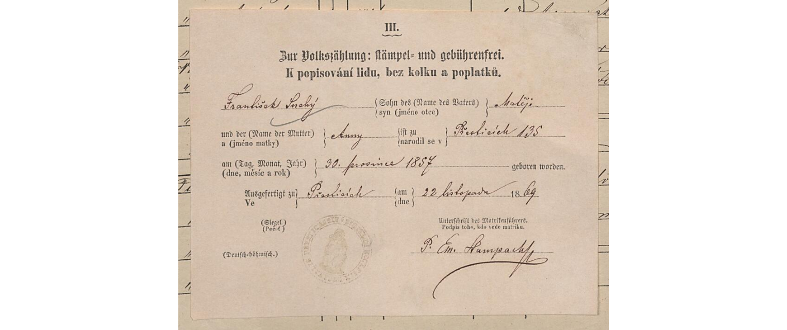
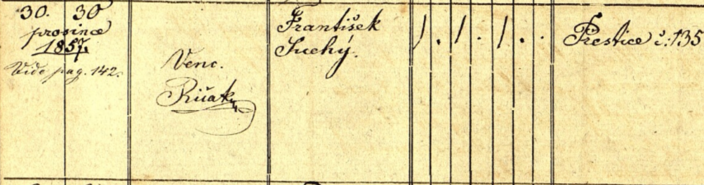
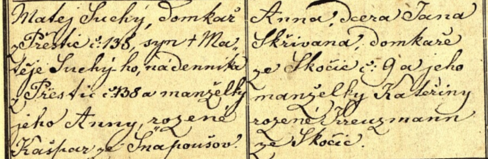
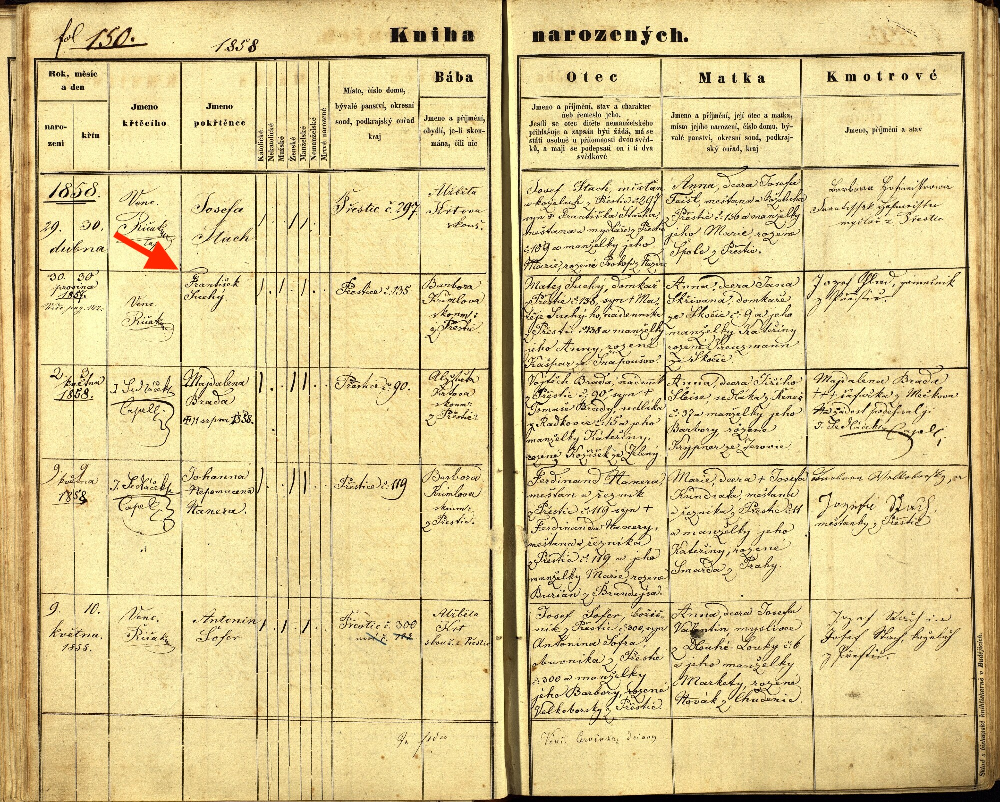

# Franz Suchÿ

## Frantisek Suchý
1857–1915
- BIRTH 30/12/1857 • Prestice, West Bohemia, Czech Republic
- DEATH BEF. 11/03/1915 • Humbolt Hansa, Brazil

Possíveis registros relacionados à familia

[Censo 1869](http://www.portafontium.eu/iipimage/34504773/soap-pj_00302_census-1869-prestice-cp332_0010){:target="_blank"}

[Censo 1890](http://www.portafontium.eu/iipimage/34539736/soap-pj_00302_census-1890-radkovice-cp033_0010?x=17&y=417&w=264&h=99){:target="_blank"}

#### Registro de Nascimento - Censo
{:target="_blank"}

#### Registro de Nascimento - Livro de Nascimentos
{:target="_blank"}
{:target="_blank"}
{:target="_blank"}